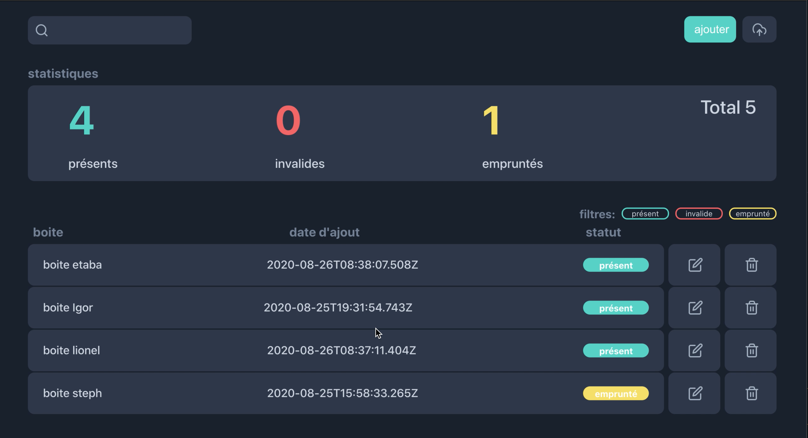

# Archy: archive manager application
------------------------------------

## Description

A **desktop application** meant to be used by **archivists**. The user must be able to

* add archive boxes
* add boxes content(documents)
* edit boxes and boxes content
* delete boxes or documents inside boxes
* handle borrowing of boxes with return dates
* handle boxes expiration dates
* search boxes by their name

The application must notify the user when the return or expiration dates are close 

The application must also have the ability to filter boxes by their status(present, borrowed or expired)

Built with [**Electron**](https://www.electronjs.org) and [**ReactJs**](https://reactjs.org), with [**Zustand**](https://github.com/react-spring/zustand) for global state management 
and [**styled components**](https://styled-components.com) for components styling

